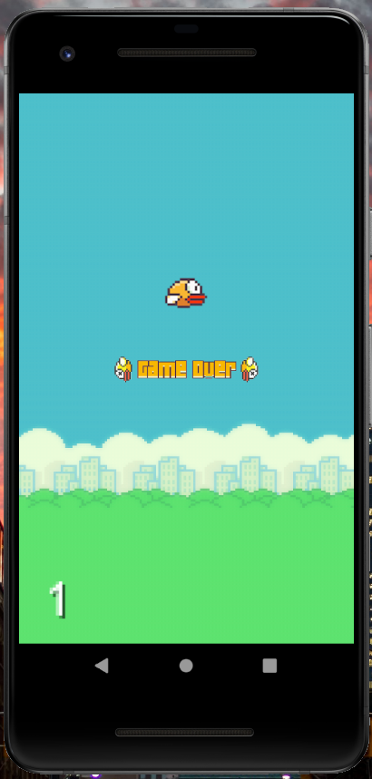
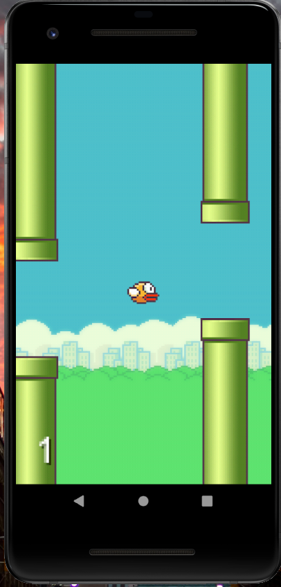

# flappy-bird-clone
Flappy Bird Game Clone Android App

This game is a clone application of the famous Flappy Bird Game where the player controls a flying bird between columns of green pipies without hitting them. The application has been developed using GDX Library and is written in Java Language. This game is compatible with all versions of Android. 

         

